# VLA C-band beam validation

This page is rendered from the compact SPW-4 validation bundle and the
shared plotting functions. It is not an independently written narrative.
The executable account is `notebooks/vla_c_band_beam_validation.ipynb`.

Bundle `vla_c_band_beam_validation_v1` checksum
`1048a28070ae96a8a2b2d233d9e4479b3e52c9bcdebe424229fc81a85188f775`.

## Executive summary

CASSBEAM is the reference diagonal C-band beam inside a stated validity
domain. It is not an unqualified high-dynamic-range model of the whole
raster. Residual power is not a flux error; the RMS visibility column is
$\sqrt{L}$. Off-axis 1 Jy residuals are voltage-beam mismatch,
$\Delta V(s)\simeq S[E_{\mathrm{measured}}(s)-E_{\mathrm{CASSBEAM}}(s)]$.

| Region | Support class | Residual power | RMS visibility | Median $|\Delta V|/I$ |
|---|---|---|---|---|
| Main lobe | **accepted** | RR 0.64%, LL 0.76% | RR 7.97%, LL 8.72% | RR 4.83%, LL 5.04% |
| Mid beam | **qualified** | RR 7.70%, LL 8.91% | RR 27.75%, LL 29.86% | RR 6.68%, LL 7.69% |
| Outer raster | **diagnostic** | RR 32.31%, LL 34.85% | RR 56.85%, LL 59.04% | RR 3.54%, LL 3.57% |

The raster reaches about ±51′ and 71′ in the corners. Outer CASSBEAM is
coherent but not unqualified:
correlation 0.825 / 0.812,
median |V| ratio 1.61 / 1.60.
A common scalar beam cancels voltage phase in Stokes I. Outer phase
maps are exploratory. The dB ratio is diagnostic only: when CASSBEAM
is 0.05–0.15 Jy and the residual floor is ~0.2 Jy, magnitude ratios
are biased upward and are not a multiplicative correction.

Complex slopes are 1.032+0.003i (RR) and
1.029+0.004i (LL), with correlations
0.971 /
0.968.

The C147-* ring at 3.61′ gives RR/LL residual power
1.17% / 0.90% after the geometric fringe.
That Q/U result is not a frequency holdout.

The cross-hand result is a sensitivity-limited non-detection:
RL/LR correlation 0.101 / 0.104,
residual power 0.994 / 0.992.

Publication squint uses the 20%-of-peak main-lobe estimator:
measured 0.515′,
Memo 195 0.526′,
CASSBEAM 0.411′.

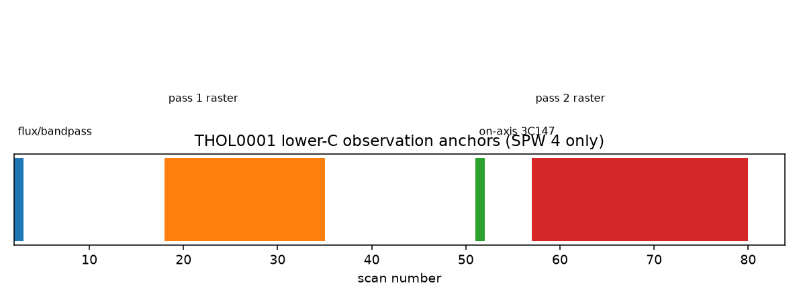

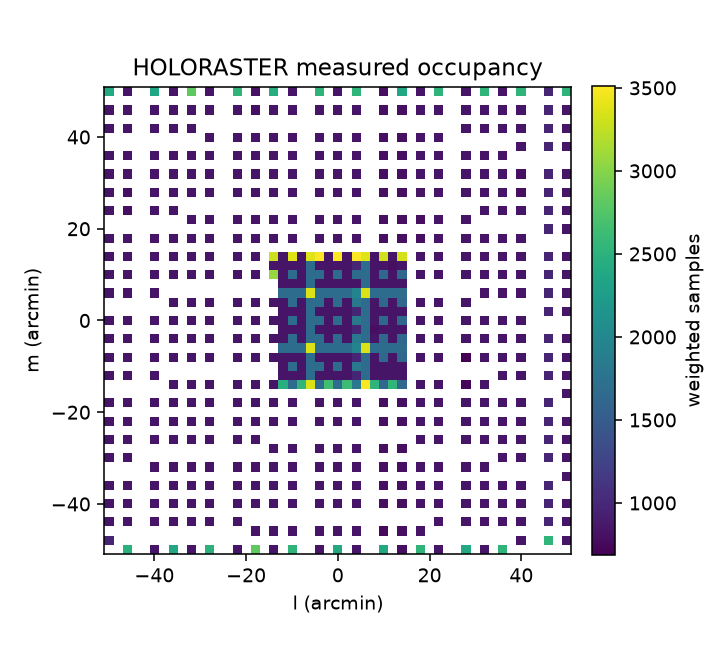

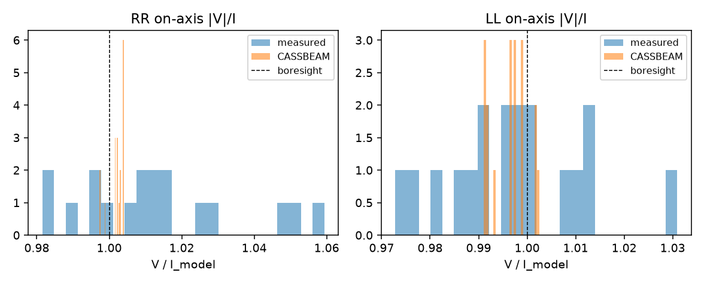

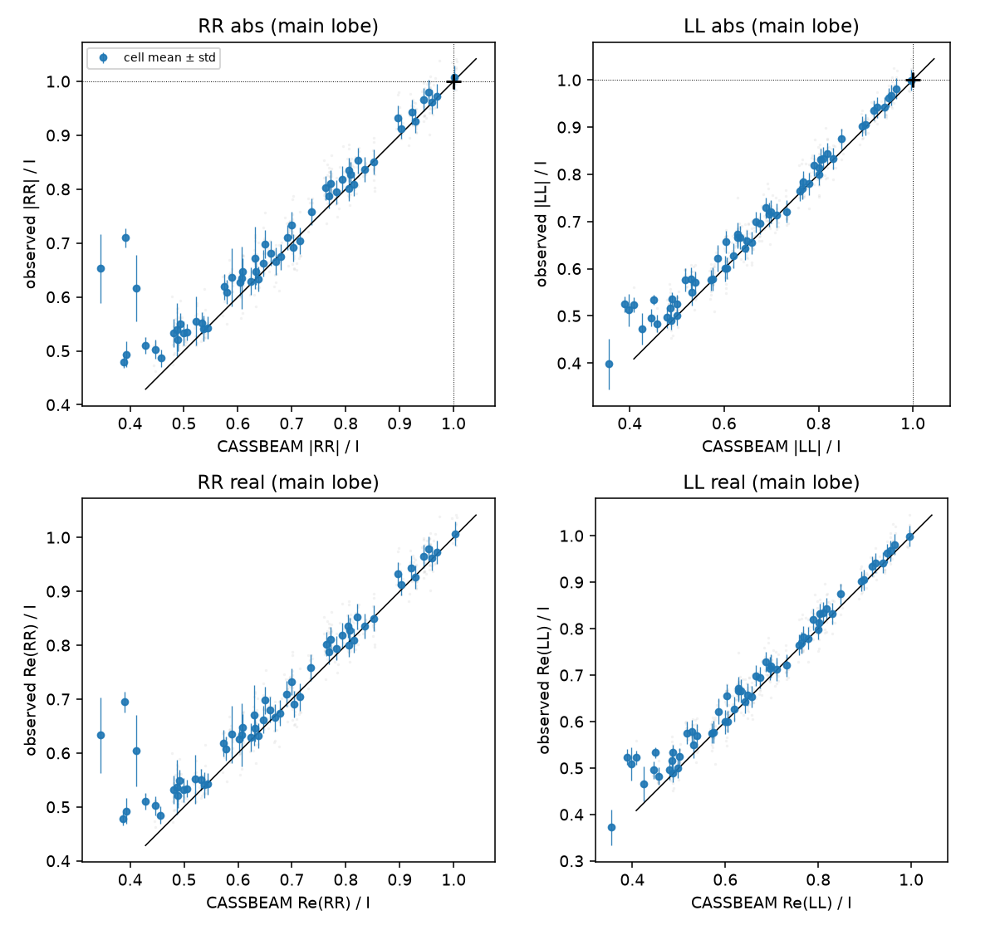

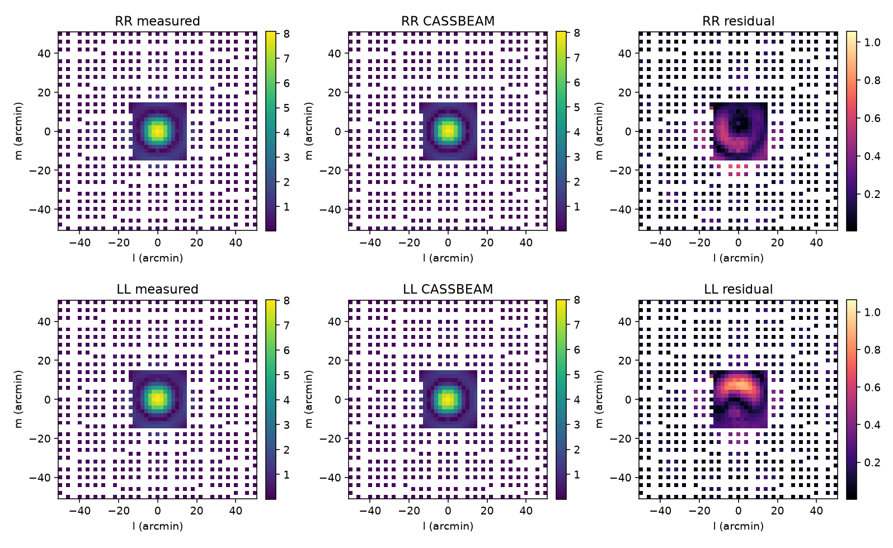

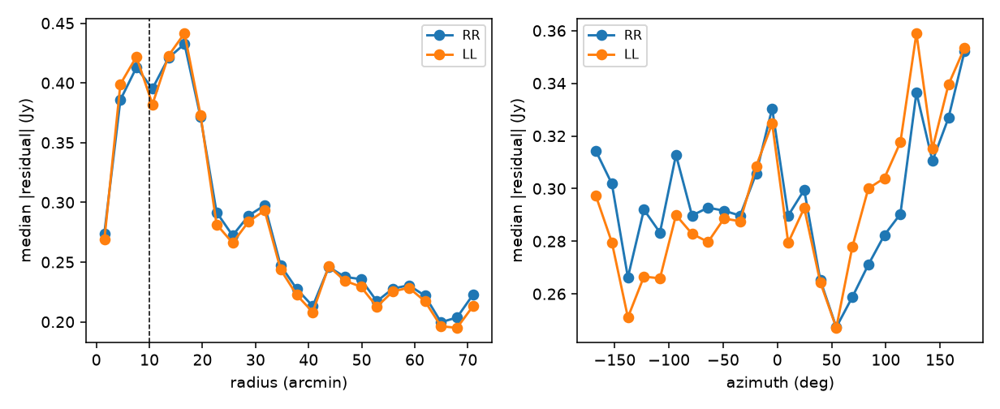

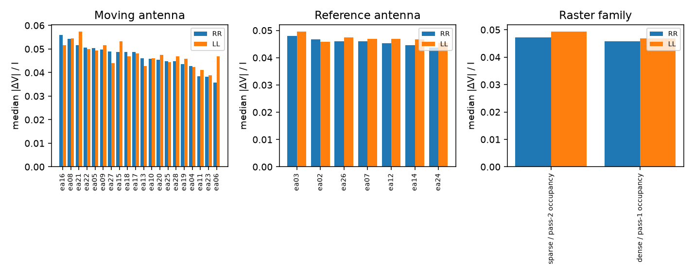

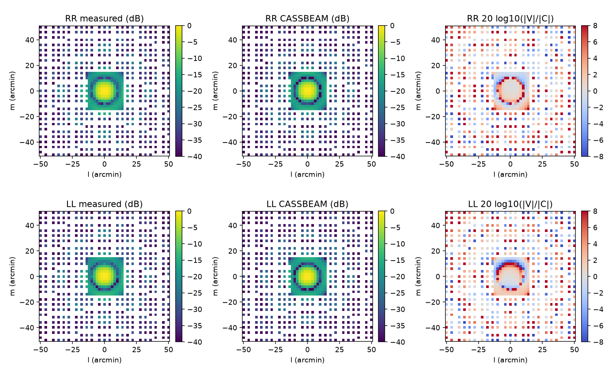

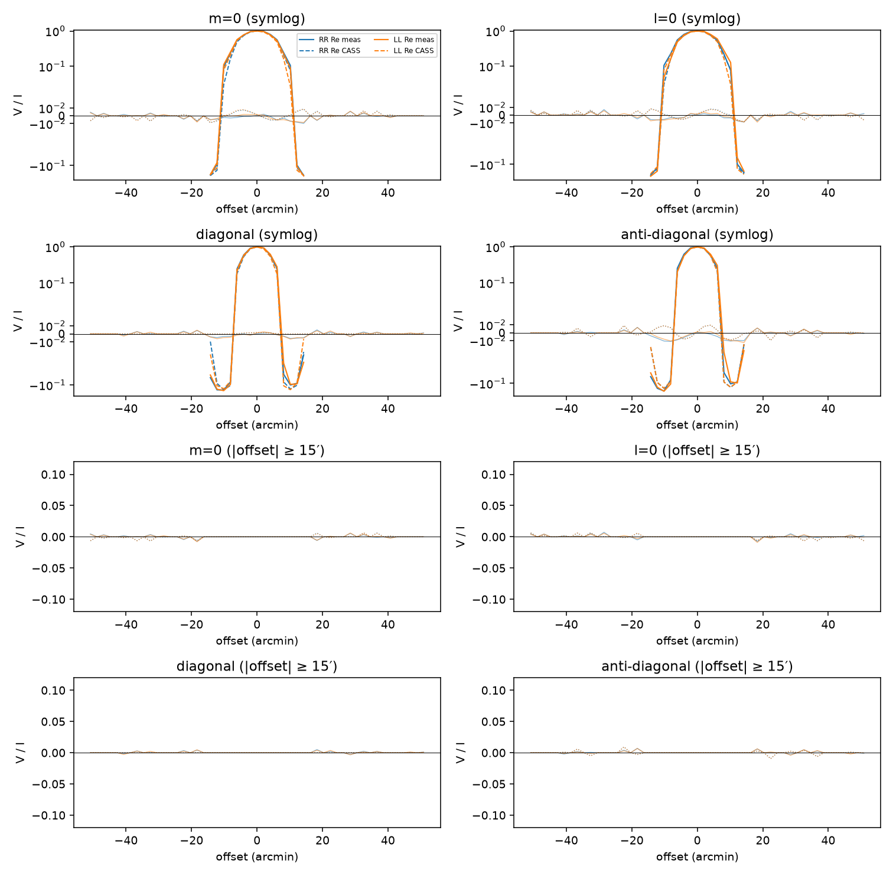

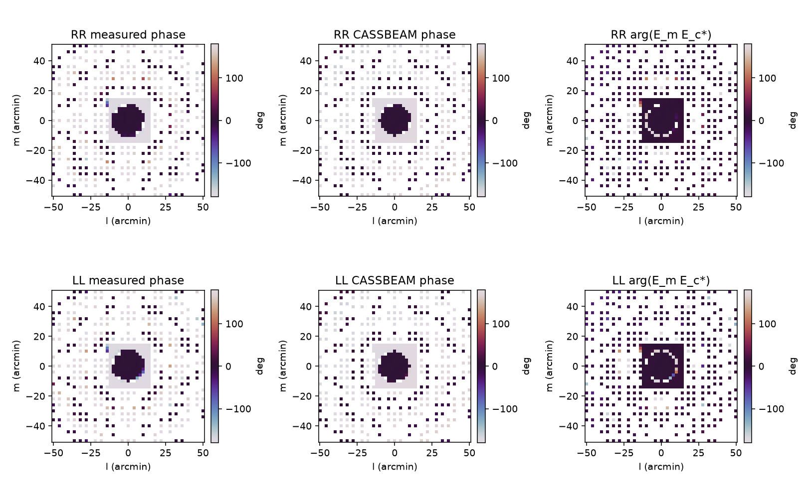

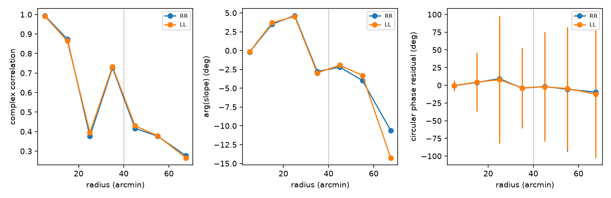

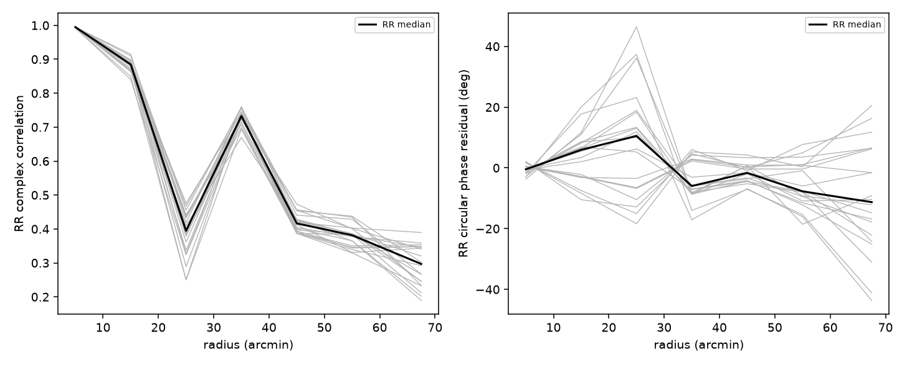

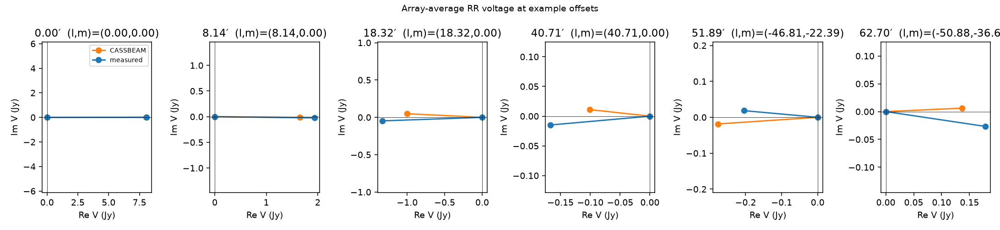

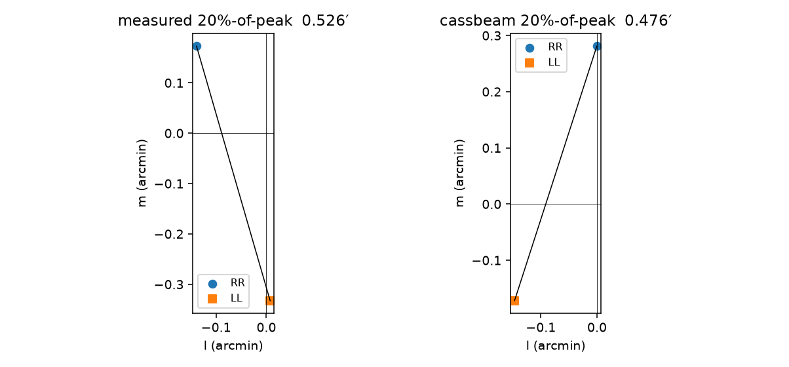

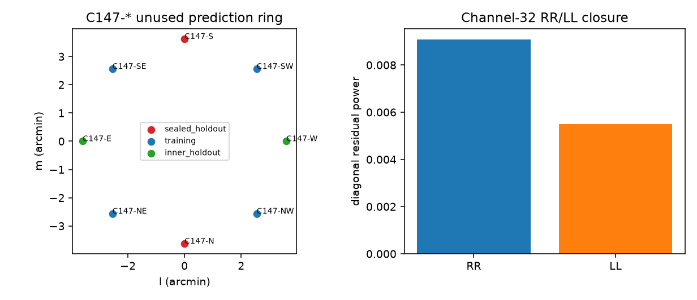

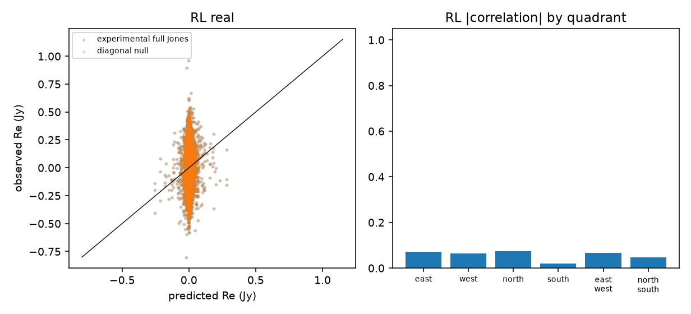

## Claim registry

| ID | Status | Claim |
|---|---|---|
| C01 | pass | CASSBEAM is the SPW-4 diagonal C-band reference in the main lobe |
| C02 | warn | Middle-beam CASSBEAM is useful but imperfect |
| C03 | warn | Outer-raster CASSBEAM is diagnostic only |
| C04 | pass | The C147-* offset ring independently supports the diagonal beam |
| C05 | blocked | CASSBEAM full Jones is an experimental non-detection |
| C06 | not_run | SPW 5 remains sealed |
| C07 | pass | Publication squint uses the 20%-of-peak main-lobe estimator |

## Limitations

- Use CASSBEAM as the diagonal structural prior; trust the main beam most strongly.
- Mid beam is qualified; attach substantial model uncertainty outside it.
- Bright out-of-field sources can be misestimated by factors of two or more.
- Do not infer a general outer phase correction from the current phase means.
- Outer-field corrections must transfer across movers and spatial holdouts;
  otherwise use source-specific nuisance terms or peeling.
- One published SPW-4 frequency; SPW 5 remains sealed.
- Full Jones is an experimental non-detection below the THOL0001 floor.
- The next artifact is a validation-selected low-order diagonal correction.
- The independent physical squint/width experiment is SPW-4 development
  only; see `thol0001_spw4_physical_squint_width.md`. SPW 5 stays sealed.
